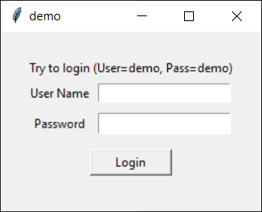
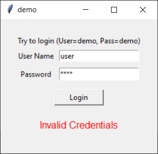
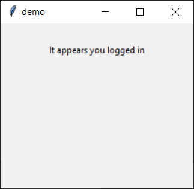

# About

Local login app writtin in python for the purpose of demonstrating

- Simple GUI with tkinter ( I don't condone the use of tkinter )
- Building distribution binaries with pyinstaller
- External configuration

**Security principles in the demo (Not relevant to the to python, building and distribution)**
This application uses a cryptographic hash to store the "sensitive" information on the disk. The user name and password are checked by comparing their corresponding hashed representations to the stored hashed representations. PII, Sensitive data and Login credentials should never be stored in plain text, or better yet, it should not be stored at all. A better technique is to use third party authentication providers like Oauth2 with Google etc. Cryptographic hashes are deterministic one way algorithms (Always produce the same output with a given input) that take low entropy byte arrays as input and produce a seemingly random and highly entropic byte array as a result. A small change in the input produces a drastic change in the output, and a small input can produce a large output. Because hash algorithms are deterministic and people tend to use simple passwords, common passphrases can be found in "Rainbow Tables" or even Googled. Rainbow tables can be generated by hashing common passphrases or brute forcing every possible input. This allows exploiters to "lookup" a password by it's hash. To thwart this attack, Cryptographic Salt is added to the hash method to make the application hash results unique. This means that an attacker would have to have access to the Salt key in order to produce the Rainbow/Attack table. In production the Salt should be generated at run time or saved to another secure location. A hash algorithm is not an encryption algorithm or a cipher. Encryption algorithms imply that there should be a decryption method and ciphers are just simple substitutions.

## Setup dev environment

1. [Install python > 3.1](https://google.com/search?q=install+python+3)
2. [Install pip](https://google.com/search?q=install+pip)
3. Install pyinstaller by running `pip install pyinstaller`

## Running

- Run source: `python demo-app.py`
- Run binaries from command line or double click them (found in `/dist` once built)

## Building

Building the application puts a distributable binary in the `/dist` folder for the operating system on which it was built. The `config.ini` file is copied to the dist folder by `build.bat`

- run `build.bat` to build on windows
- [Pyinstaller docs](https://pyinstaller.readthedocs.io/en/stable/usage.html)

## Screenshots

1. Welcome Screen

2. Login Failure

3. Login Success

